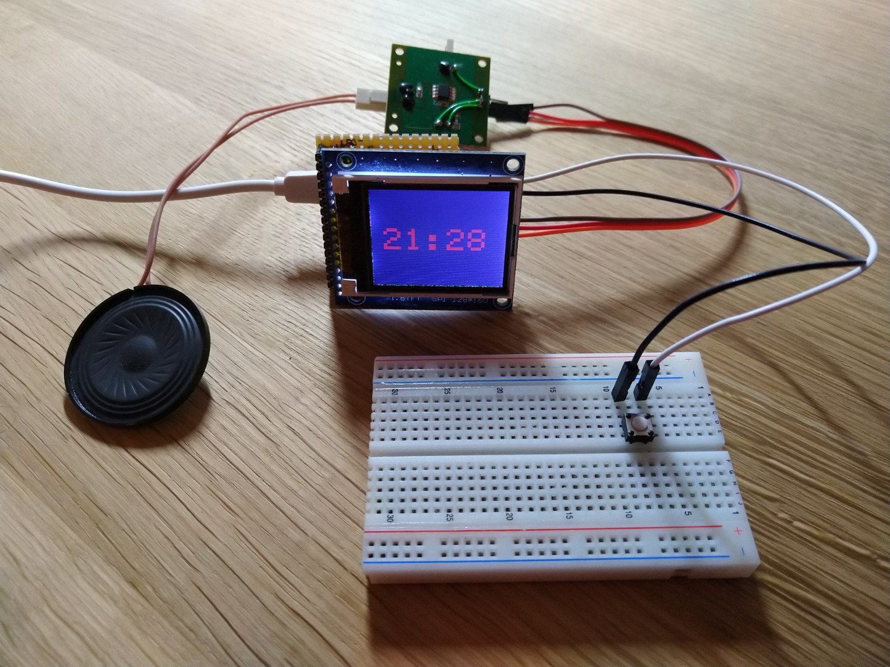
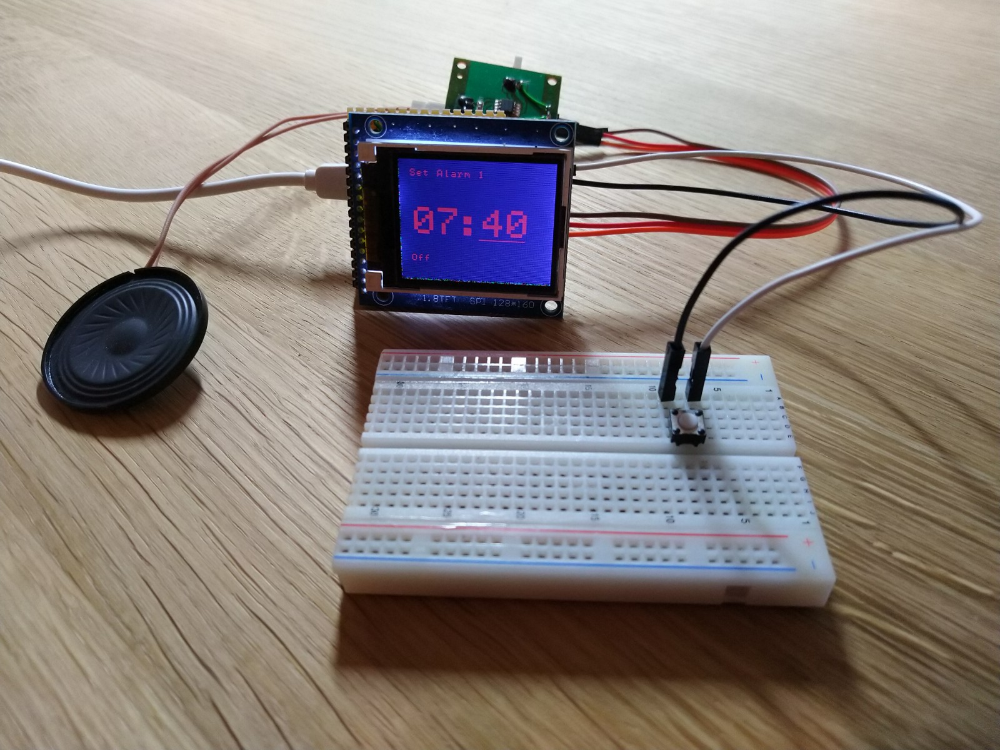

So far, a simple alarm clock using ESP8266 and [ST7735](https://github.com/mo-pyy/micropython-st7735-esp8266) written in [Micropython](https://micropython.org/). The architecture is inspired by [React](https://reactjs.org).

It tells the time ...

... and has some simple UI elements

# Setup
- Flash the micropython firmware
- Install the required python packages (essentially ampy and mpy-cross)
- Adjust the serial device path in the Makefile
- Init the [ST7735](https://github.com/mo-pyy/micropython-st7735-esp8266) driver submodule
- Init the [WiFiManager](https://github.com/tayfunulu/WiFiManager) submodule
- Run `make`
- Launch `main.main()` from the serial REPL or permanently from `boot.py`
